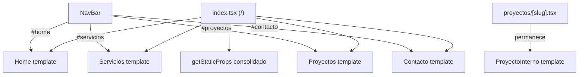

# Documento de Diseño: Single Page Landing

## Resumen

Convertir el sitio multi-página de Hexagon Studio en una landing page de una sola página. La ruta `/` (`index.tsx`) renderizará secuencialmente las secciones Home, Servicios, Proyectos y Contacto. La NavBar usará anclas (`#id`) con scroll suave en lugar de enlaces a rutas. Se eliminarán las páginas `servicios.tsx`, `proyectos/index.tsx` y `contacto.tsx`. La ruta dinámica `/proyectos/[slug]` permanece intacta.

## Arquitectura

La arquitectura actual usa Next.js Pages Router con una página por sección. La nueva arquitectura consolida todo en `index.tsx` que importa y renderiza los templates existentes en secuencia.



### Decisiones de diseño

1. **Reutilizar templates existentes**: Los componentes en `src/components/templates/` se reutilizan tal cual, envueltos en `<section id="...">` en `index.tsx`. Esto minimiza cambios y riesgo.
2. **Scroll suave con CSS**: Usar `scroll-behavior: smooth` en el HTML root + `scroll-margin-top` para compensar la NavBar fija, en lugar de JavaScript custom. Es más simple y funciona en todos los navegadores modernos.
3. **IntersectionObserver para sección activa**: La NavBar usará `IntersectionObserver` para detectar qué sección está visible y resaltar el enlace correspondiente.
4. **Un solo getStaticProps**: Consolidar la carga de imágenes con plaiceholder y la lista de proyectos en un solo `getStaticProps` en `index.tsx`.

## Componentes e Interfaces

### Componentes modificados

| Componente  | Archivo                                            | Cambio                                                                                                                             |
| ----------- | -------------------------------------------------- | ---------------------------------------------------------------------------------------------------------------------------------- |
| `index.tsx` | `src/pages/index.tsx`                              | Renderiza Home + Servicios + Proyectos + Contacto. `getStaticProps` consolidado.                                                   |
| `NavBar`    | `src/components/modules/NavBar/navBar.tsx`         | Enlaces cambian a anclas `#id`. Agrega `IntersectionObserver` para sección activa. Scroll suave en click.                          |
| `Home`      | `src/components/templates/Home/home.tsx`           | Enlaces internos (`/proyectos`, `/contacto`, `/servicios`) cambian a anclas.                                                       |
| `Servicios` | `src/components/templates/Servicios/servicios.tsx` | Enlace `/contacto` cambia a `#contacto`. Eliminar import de `GetStaticProps`/`InferGetStaticPropsType` (ya no se usa como página). |
| `Proyectos` | `src/components/templates/Proyectos/proyectos.tsx` | Enlace `/contacto` cambia a `#contacto`. Links a `/proyectos/[slug]` permanecen.                                                   |
| `Contacto`  | `src/components/templates/Contacto/contacto.tsx`   | Sin cambios funcionales (no tiene enlaces internos a otras secciones). Ajustar padding-top ya que no es página independiente.      |
| `Footer`    | `src/components/modules/Footer/footer.tsx`         | Sin cambios (solo tiene enlaces externos y al home).                                                                               |

### Archivos eliminados

- `src/pages/servicios.tsx`
- `src/pages/proyectos/index.tsx`
- `src/pages/contacto.tsx`

### Archivos sin cambios

- `src/pages/proyectos/[slug].tsx`
- `src/pages/404.tsx`
- `src/pages/api/contact.ts`
- `src/pages/_app.tsx`
- `src/components/layout/DefaultLayout/defaultLayout.tsx`

### Interfaz de NavBar actualizada

```typescript
// navBar.tsx - Lógica de sección activa
const sectionIds = ['home', 'servicios', 'proyectos', 'contacto'];

const navLinks = [
  { name: 'Inicio', href: '#home' },
  { name: 'Servicios', href: '#servicios' },
  { name: 'Proyectos', href: '#proyectos' },
  { name: 'Contacto', href: '#contacto' },
];

// IntersectionObserver para detectar sección visible
// Estado: activeSection: string
```

### Estructura de index.tsx

```tsx
// src/pages/index.tsx
<>
  <Head>...</Head>
  <section id="home">
    <Home imageProps={imageProps} projects={projects} />
  </section>
  <section id="servicios">
    <Servicios imageProps={serviciosImageProps} />
  </section>
  <section id="proyectos">
    <Proyectos projects={projects} />
  </section>
  <section id="contacto">
    <Contacto />
  </section>
</>
```

## Modelos de Datos

No hay cambios en los modelos de datos. Las interfaces `imageProps`, `projectsProps` y `projectProps` en `src/utils/types/generalProps.ts` permanecen iguales.

El `getStaticProps` consolidado en `index.tsx` retornará:

```typescript
{
  props: {
    imageProps: [/* imágenes Home con blur placeholders */],
    serviciosImageProps: [/* imagen teamwork con blur placeholder */],
    projects: [/* lista de proyectos */],
  }
}
```

## Propiedades de Correctitud

_Una propiedad es una característica o comportamiento que debe cumplirse en todas las ejecuciones válidas de un sistema — esencialmente, una declaración formal sobre lo que el sistema debe hacer. Las propiedades sirven como puente entre especificaciones legibles por humanos y garantías de correctitud verificables por máquina._

### Propiedad 1: Los enlaces internos de sección usan formato de ancla

_Para cualquier_ enlace interno en la landing page que apunte a una sección del sitio (servicios, proyectos, contacto), el atributo `href` debe usar formato de ancla (`#seccion`) en lugar de formato de ruta (`/seccion`).

**Valida: Requisitos 5.1, 5.2, 5.3**

### Propiedad 2: Los enlaces a proyectos individuales permanecen como navegación estándar

_Para cualquier_ enlace a un proyecto individual (`/proyectos/[slug]`), el enlace debe usar navegación estándar con `Link` de Next.js y un `href` con ruta completa (no ancla).

**Valida: Requisito 5.4**

### Propiedad 3: Click en enlace de navegación desplaza al destino correcto

_Para cualquier_ enlace de la NavBar (desktop o móvil), al hacer clic, la vista debe desplazarse hasta la sección cuyo `id` coincide con el fragmento del `href`. Si el menú móvil está abierto, debe cerrarse.

**Valida: Requisitos 2.1, 2.3**

### Propiedad 4: El resaltado de sección activa refleja la sección visible

_Para cualquier_ posición de scroll en la landing page, el enlace resaltado en la NavBar debe corresponder a la sección actualmente visible en el viewport.

**Valida: Requisito 3.1**

## Manejo de Errores

| Escenario                                                          | Manejo                                                                                                                                                      |
| ------------------------------------------------------------------ | ----------------------------------------------------------------------------------------------------------------------------------------------------------- |
| Navegación a `/servicios`, `/proyectos` o `/contacto` directamente | Estas rutas ya no existen. El usuario verá la página 404 existente. Se puede considerar agregar redirects en `next.config.js` para redirigir a `/#seccion`. |
| Fallo en `getStaticProps` (plaiceholder o datos)                   | El build de Next.js fallará, igual que el comportamiento actual. No hay cambio.                                                                             |
| `IntersectionObserver` no soportado                                | Fallback: no se resalta ninguna sección. La navegación por anclas sigue funcionando.                                                                        |
| Hash en URL al cargar la página (ej: `/#contacto`)                 | El navegador scrollea automáticamente al elemento con ese `id`. `scroll-behavior: smooth` aplica.                                                           |

## Estrategia de Testing

### Tests unitarios

- Verificar que `index.tsx` renderiza las 4 secciones con los `id` correctos en el orden esperado (1.1, 1.2)
- Verificar que la NavBar renderiza enlaces con `href` de ancla en lugar de rutas (2.2)
- Verificar que las páginas eliminadas no existen en `src/pages/` (4.1)
- Verificar que `/proyectos/[slug]` sigue funcionando (4.2)

### Tests de propiedades (property-based)

Librería: `fast-check` con el test runner existente del proyecto (o Jest si se agrega).

Configuración: mínimo 100 iteraciones por test.

Cada test de propiedad debe referenciar su propiedad del diseño con un comentario:

```
// Feature: single-page-landing, Property {N}: {título}
```

- **Propiedad 1**: Generar un conjunto aleatorio de enlaces internos renderizados en la landing page. Para cada enlace que apunte a una sección (servicios, proyectos, contacto), verificar que usa formato `#seccion`.
- **Propiedad 2**: Generar un conjunto aleatorio de enlaces a proyectos individuales. Verificar que cada uno usa ruta completa `/proyectos/{slug}` y no ancla.
- **Propiedad 3**: Para cada enlace de la NavBar, simular click y verificar que `scrollIntoView` se invoca con el elemento correcto. Si el menú móvil está abierto, verificar que se cierra.
- **Propiedad 4**: Para una secuencia aleatoria de posiciones de scroll, verificar que el `IntersectionObserver` callback actualiza `activeSection` al `id` de la sección visible.
